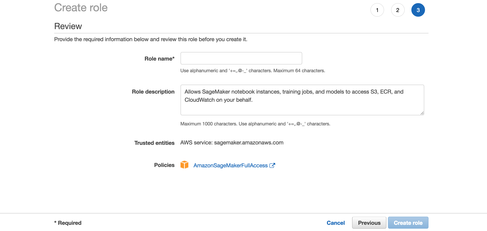
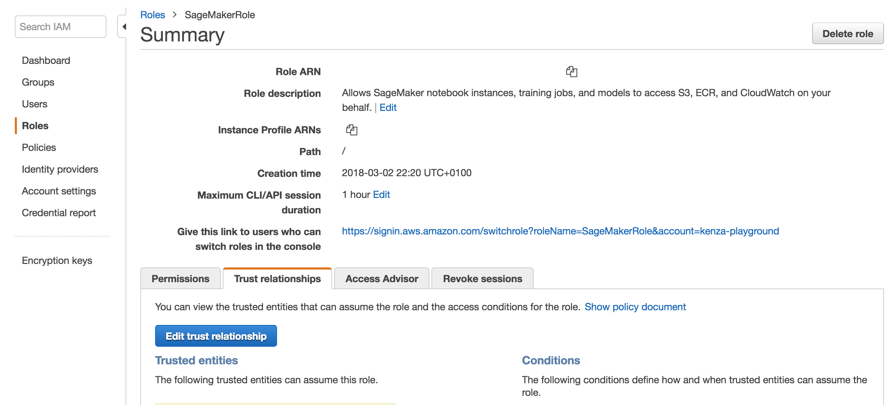

# Your First Machine Learning Model on SageMaker

This example shows how to train and deploy a scikit-learn based Machine Learning model on Amazon SageMaker.

It is inspired by [Sagify](https://github.com/Kenza-AI/sagify) and [Amazon SageMaker Examples](https://github.com/awslabs/amazon-sagemaker-examples).

## Requirements

1. Python 3.6 is installed
2. `mkvirtualenv packt-sagemaker`. Make sure the virtualenv is activated after you create it.
3. `pip install jupyter sagemaker numpy scipy scikit-learn pandas`

## How Amazon SageMaker Runs Training and Prediction

1. `docker run image train`: for training
2. `docker run image serve`: for prediction

## Training

### Data

The [iris](https://archive.ics.uci.edu/ml/datasets/iris) data set is used for training the model.

### Machine Learning Algorithm

[scikit-learn's Random Forest implementation](http://scikit-learn.org/stable/modules/generated/sklearn.ensemble.RandomForestClassifier.html) is chosen in order to train the iris classifier.

### Machine Learning Model Accuracy Metrics

Precision and Recall are used to evaluate the trained ML model.

## Prediction

The following technologies are used in order to build a RESTful prediction service:

1. [nginx](https://www.nginx.com/): a high-performance web server to handle and serve HTTP requests and responses, respectively.
2. [gunicorn](https://gunicorn.org/): a Python WSGI HTTP server responsible to run multiple copies of your application and load balance between them.
3. [flask](http://flask.pocoo.org/): a Python micro web framework that lets you implement the controllers for the two SageMaker endpoints `/ping` and `/invocations`. 

REST Endpoints:

1. `GET /ping`: health endpoint
2. `POST /invocations`: predict endpoint that expects a JSON body with the required features

## Code

1. `train_and_deploy_your_first_model_on_sagemaker.ipynb`: Jupyter notebook to train/deploy your first ML model on SageMaker

## Setup AWS Profile

This step is described in the very first video. Here it is described again as it is an essential step before starting to interact with SageMaker.

### Configure AWS Account

- Sign in to the AWS Management Console as an IAM user and open the IAM console at <https://console.aws.amazon.com/iam/>
- Select `Roles` from the list in the left-hand side, and click on *Create role*
- Then, select *SageMaker* as the image shows:

- Click *Next: Review* on the following page:

- Type a name for the SageMaker role, i.e. `PacktSageMaker`, and click on *Create role*:

- Click on the created role and, then, click on *Attach policy* and search for `AmazonEC2ContainerRegistryFullAccess`. Attach the corresponding policy:

- Do the same to attach the `AmazonS3FullAccess` and `IAMReadOnlyAccess` policies, and end up with the following:

- Now, go to Users page by clicking on *Users* on the left-hand side.

- Click on *Add user* and type *packt-sagemaker* as username.

- Copy the ARN of that user.

- Then, go back the page of the Role you created and click on the *Trust relationships* tab:

- Click on *Edit trust relationship* and add the following:

        {
            "Version": "2012-10-17",
            "Statement": [
                {
                    "Sid": "",
                    "Effect": "Allow",
                    "Principal": {
                        "AWS": "PASTE_THE_ARN_YOU_COPIED_EARLIER",
                        "Service": "sagemaker.amazonaws.com"
                    },
                    "Action": "sts:AssumeRole"
                }
            ]
        }
        
- You're almost there! Make sure that you have added the IAM user in your `~/.aws/credentials` file. For example:
    
        [packt-sagemaker]
        aws_access_key_id = ...
        aws_secret_access_key = ...

 - And, finally, add the following in the `~/.aws/config` file:
 
        [profile packt-sagemaker]
        region = us-east-1
        role_arn = COPY_PASTE_THE_ARN_OF_THE_CREATED_ROLE_NOT_USER! for example: arn:aws:iam::...:role/PacktSageMaker
        source_profile = packt-sagemaker

- That's it! You'ready to start using SageMaker!
